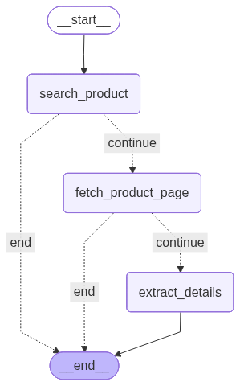

# 🛒 ShopSmart AI — Amazon Product Comparison Tool

An AI-powered product comparison tool that scrapes Amazon India, extracts structured product details using LLMs, and provides intelligent side-by-side comparisons with purchase recommendations.


---

## 📋 Table of Contents

- [Features](#-features)
- [Architecture](#-architecture)
- [Tech Stack](#-tech-stack)
- [How It Works](#-how-it-works)
- [Setup & Installation](#-setup--installation)
- [Configuration](#-configuration)
- [Usage](#-usage)
- [Deployment](#-deployment)
- [Project Structure](#-project-structure)
- [Troubleshooting](#-troubleshooting)
- [Limitations](#-limitations)
- [Future Improvements](#-future-improvements)

---

## ✨ Features

- **Smart Product Search** — Searches Amazon India and uses LLM to pick the exact product from results (not accessories or wrong variants)
- **Structured Data Extraction** — Extracts price, rating, reviews, brand, specs, and highlights into a clean schema
- **AI-Powered Comparison** — Compares up to 3 products with a detailed markdown report including pros/cons and final recommendation
- **Bot Detection Bypass** — Uses Playwright (headless Chromium) to render pages like a real browser
- **Rate Limit Handling** — Built-in retry logic with exponential backoff for Groq API limits
- **Dual Deployment** — Supports both Streamlit Cloud (with secrets.toml) and Docker/Railway (with env vars)

---

## 🏗 Architecture



```
┌─────────────────────────────────────────────────────────┐
│                    Streamlit UI                          │
│  (User inputs product names, sees results & comparison) │
└─────────────────────┬───────────────────────────────────┘
                      │
                      ▼
┌─────────────────────────────────────────────────────────┐
│                 LangGraph Pipeline                       │
│                                                         │
│  ┌──────────────┐    ┌──────────────┐    ┌───────────┐ │
│  │   Node 1:    │    │   Node 2:    │    │  Node 3:  │ │
│  │   Search     │───▶│   Fetch      │───▶│  Extract  │ │
│  │   Product    │    │   Page       │    │  Details  │ │
│  └──────────────┘    └──────────────┘    └───────────┘ │
│        │                    │                   │       │
│        ▼                    ▼                   ▼       │
│   Playwright +         Playwright          Groq LLM    │
│   LLM (8B)            (Chromium)        (70B structured│
│                                           output)      │
└─────────────────────────────────────────────────────────┘
                      │
                      ▼
┌─────────────────────────────────────────────────────────┐
│              Comparison (if 2+ products)                 │
│              LLM generates markdown report              │
└─────────────────────────────────────────────────────────┘
```

---

## 🛠 Tech Stack

| Component | Technology | Purpose |
|-----------|-----------|---------|
| **Frontend** | Streamlit | Interactive web UI |
| **Orchestration** | LangGraph | Agentic workflow with conditional edges |
| **LLM Provider** | Groq (Llama 3.1 8B + Llama 3.3 70B) | Product selection & structured extraction |
| **Web Scraping** | Playwright (Chromium) | Renders JavaScript-heavy Amazon pages |
| **HTML Parsing** | BeautifulSoup4 | Targeted extraction of product elements |
| **Data Validation** | Pydantic v2 | Structured output schema enforcement |
| **Observability** | LangSmith | Tracing & debugging LLM calls |
| **Deployment** | Docker + Railway / Streamlit Cloud | Production hosting |

---

## ⚙️ How It Works

### Node 1: `search_product`
1. Constructs Amazon India search URL from user query
2. Fetches search results page via Playwright
3. Parses all product cards, extracting ASIN, title, and price
4. Filters out sponsored items using multiple detection patterns
5. Sends candidate list to **Llama 3.1 8B** to pick the best match
6. Returns the selected product's Amazon URL

### Node 2: `fetch_product_page`
1. Fetches the product detail page via Playwright
2. Extracts product image (landingImage, hiRes, etc.)
3. Runs `html_to_text()` — a targeted extractor that pulls:
   - Title, Price, MRP, Rating, Reviews, Brand
   - Feature bullets
   - Technical Details tables (by ID and class)
   - Product overview rows
   - Fallback: generic text if targeted extraction fails

### Node 3: `extract_details`
1. Sends extracted text to **Llama 3.3 70B** with structured output
2. Returns a `ProductSpecs` Pydantic model with all fields
3. Includes fallback parsing from `failed_generation` errors
4. Retries with exponential backoff on rate limits

### Comparison
- After all products are extracted, sends structured data to LLM
- Generates markdown with comparison table, pros/cons, and recommendation

---

## 🚀 Setup & Installation

### Prerequisites
- Python 3.12+
- A [Groq API key](https://console.groq.com) (free tier available)

### Local Development

```bash
# Clone the repository
git clone https://github.com/TanmoyTiger/ShopSmart-AI.git
cd ShopSmart-AI

# Create virtual environment
python -m venv myenv
source myenv/bin/activate  # macOS/Linux
# myenv\Scripts\activate   # Windows

# Install dependencies
pip install -r requirements.txt

# Install Playwright browser
playwright install chromium

# Run the app
streamlit run amazon_product_comparision.py
```

---

## 🔧 Configuration

### Environment Variables

Create a `.env` file (for local development with `load_dotenv`):

```env
GROQ_API_KEY=gsk_your_groq_api_key_here
LANGSMITH_TRACING=false
LANGSMITH_ENDPOINT=https://api.smith.langchain.com
LANGSMITH_API_KEY=lsv2_your_langsmith_key_here
LANGSMITH_PROJECT=Shopping
```

### Streamlit Secrets (for Streamlit Cloud or local `.streamlit/secrets.toml`):

```toml
GROQ_API_KEY = "gsk_your_groq_api_key_here"
LANGSMITH_TRACING = "false"
LANGSMITH_ENDPOINT = "https://api.smith.langchain.com"
LANGSMITH_API_KEY = "lsv2_your_langsmith_key_here"
LANGSMITH_PROJECT = "Shopping"
```

### LLM Models Used

| Model | Role | Why |
|-------|------|-----|
| `llama-3.1-8b-instant` | Search selection, comparison | Fast, cheap, good enough for simple tasks |
| `llama-3.3-70b-versatile` | Product extraction | Accurate structured output from noisy HTML |

---

## 📖 Usage

1. Open the app in your browser (default: `http://localhost:8501`)
2. Select how many products to compare (1–3)
3. Enter product names (e.g., "OnePlus 13R 5G", "Samsung Galaxy A56 5G")
4. Click **🔍 Extract Details**
5. Wait for extraction (~15–30 seconds per product)
6. View extracted details, specs, and AI comparison

### Tips for Best Results
- Be specific: include brand + model + variant (e.g., "iPhone 16 Pro 256GB")
- Avoid very new products that may not have Amazon listings yet
- If a product fails, try slightly different search terms

---

## 🚢 Deployment

### Option 1: Railway (Recommended — supports Playwright)

1. Push code to GitHub
2. Go to [railway.app](https://railway.app) → New Project → Deploy from GitHub
3. Add environment variables in Railway dashboard
4. Railway auto-detects the `Dockerfile` and builds

The `Dockerfile` installs Chromium and all system dependencies.

### Option 2: Run Locally

```bash
# Clone the repository
git clone https://github.com/TanmoyTiger/ShopSmart-AI.git
cd ShopSmart-AI

# Create and activate virtual environment
python -m venv myenv
source myenv/bin/activate  # macOS/Linux

# Install dependencies
pip install -r requirements.txt

# Install Playwright browser
playwright install chromium

# Create .env file with your keys
cp .env.example .env
# Edit .env and add your GROQ_API_KEY

# Run the app
streamlit run amazon_product_comparision.py
```

The app will be available at `http://localhost:8501`.

---

## 📁 Project Structure

```
ShopSmart-AI/
├── amazon_product_comparision.py   # Main Streamlit app (LangGraph pipeline)
├── requirements.txt                # Python dependencies
├── Dockerfile                      # Docker config with Playwright/Chromium
├── railway.json                    # Railway deployment config
├── .dockerignore                   # Files excluded from Docker build
├── .streamlit/
│   └── secrets.toml                # Local secrets (git-ignored)
├── .env                            # Local env vars (git-ignored)
```

---

## 🐛 Troubleshooting

| Issue | Cause | Fix |
|-------|-------|-----|
| "Product not found on Amazon" | Amazon returned blocked/empty page | Increase delay, check if Playwright is installed |
| "Too many requests" | Groq rate limit (30 req/min for 70B) | Wait 60s, reduce products to 2 |
| "Could not extract product details" | `html_to_text` returned empty | Page has non-standard layout; fallback kicks in |
| Wrong product selected | 8B model picked wrong result | Use more specific query with exact model name |
| All N/A in extraction | Product page didn't load or has unusual structure | Check sidebar debug info; try different product |
| Deployment fails with dependency conflict | `groq` version conflicts with `langchain-groq` | Don't pin `groq` directly; let `langchain-groq` manage it |

---

## ⚠️ Limitations

- **Rate Limits**: Groq free tier limits 70B model to ~30 requests/minute and ~6,000 tokens/minute
- **Amazon Bot Detection**: Consecutive rapid requests may get blocked; 12s delay between products
- **India Only**: Currently targets `amazon.in`; can be adapted for other regions
- **Max 3 Products**: Limited by LLM rate limits per session
- **No Login/Cart**: Cannot access deals requiring sign-in or account-specific pricing
- **Dynamic Content**: Some Amazon pages load specs via JavaScript that may not render in time

---

##  Author

**Tanmoy Paul** — [@TanmoyTiger](https://github.com/TanmoyTiger)
